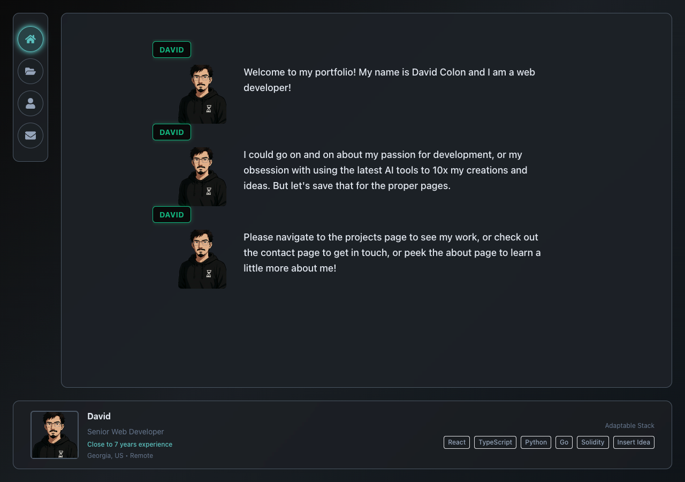

**Senior Web Engineer** | Full-Stack Developer | Game/Tech/AI Enthusiast

I'm a **Senior Web Engineer** with a passion for building, period. After a decade in the culinary world, I made the leap to software development and haven't looked back. I'm a full-stack developer comfortable working across the entire stack—from React frontends, to microservices, to Solidity smart contracts, and everything in between.

**What drives me:** (What the AI thinks anyway, It's close enough)
- Building scalable, performant applications
- Solving complex problems with elegant solutions
- Leveraging AI tools to 10x my development workflow
- Continuous learning and sharing knowledge

---

## Notable Projects

### [Decent App](https://decent.build)
A decentralized protocol for managing and operating onchain organizations. Led core features development, architecture design, and smart contract development over 5+ years.

**Tech:** React, Chakra UI, Zustand, Viem, Hardhat, Solidity  

### [bccodex](https://bccodex.com)
A web application designed as the ultimate companion tool for BitCraft Online players. Features deep recipe breakdowns, multi-source inventory tracking, and supports 5,000+ game items.

**Tech:** React, Remix, TypeScript, Chakra UI, Cloudflare  
**Features:** Complex recipe trees with 100+ items, sub-5 second calculation times

### [MCP Prompt Cleaner](https://github.com/dacebt/prompt-cleaner-mcp)
A Model Context Protocol (MCP) server that uses AI to enhance and clean raw prompts. Production-ready with comprehensive test coverage.

**Tech:** Python 3.11+, MCP Python SDK, pytest  
**Metrics:** 43 passing tests, 1,160+ lines of code, 100% test pass rate

---

## 📊 GitHub Stats

---

## Portfolio Preview

*Inspired by PlayStation and PlayStation 2 era role-playing games*

---

*"From kitchens to code—every bold step paid off."*
